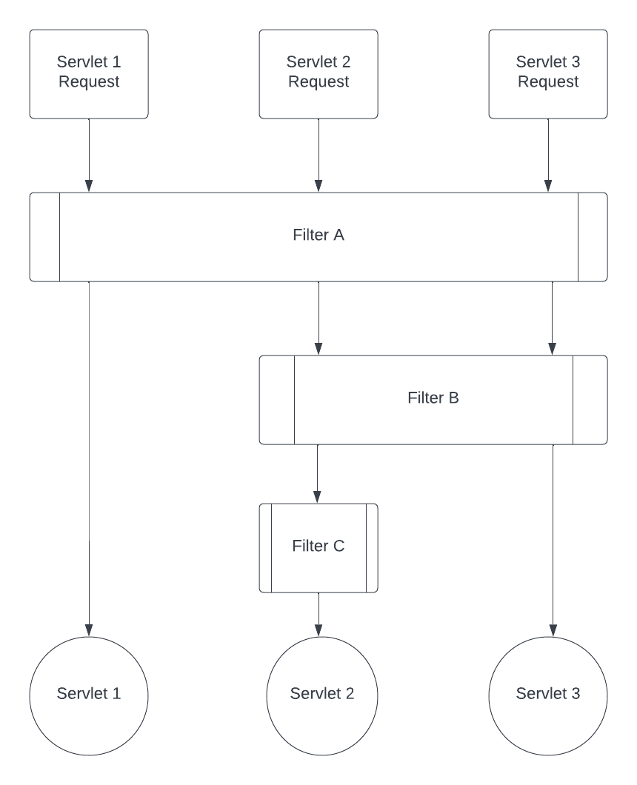

# Properly Ordering Your Filters in Web Development

In the world of web development, the order in which filters are applied to incoming requests is crucial. It determines the logical sequence of actions taken on each request. For instance, when handling authentication and authorization, it's clear that authentication must come before authorization in the processing pipeline. In this document, we'll explore how to properly order your filters.

## Setting Filter Order

As of the Servlet 4.0 Specification, which is part of the Jakarta EE 8 framework release, setting filter order using annotations is not directly supported. If you have information to the contrary, we'd appreciate you sharing it with us. Consequently, you can establish filter order using two primary methods: the deployment descriptor in `web.xml` and programmatic configuration.

### URL Pattern Mapping vs. Servlet Name Mapping

Filters are executed in the order they are defined in the configuration, either in `web.xml` or programmatically. It's important to understand the distinction between URL pattern mapping and servlet name mapping, as they affect the filter execution order.

#### URL Pattern Mapping

URL pattern mappings define which filters should be applied based on the URL patterns of incoming requests. Filters mapped to URL patterns will execute before those mapped to servlet names. Here's a visual representation:



In the figure above, different requests to different servlets are mapped to different filters, but they share the same high-level order. URL mappings take precedence over servlet name mappings.

#### Servlet Name Mapping

Servlet name mappings specify filters based on the servlets to which they should be applied. Here's an example:

```xml
<filter-mapping>
    <filter-name>servletFilter</filter-name>
    <servlet-name>myServlet</servlet-name>
</filter-mapping>

<filter-mapping>
    <filter-name>myFilter</filter-name>
    <servlet-name>/foo*</servlet-name>
</filter-mapping>

<filter-mapping>
    <filter-name>anotherFilter</filter-name>
    <servlet-name>/foo/bar</servlet-name>
</filter-mapping>
```

Suppose a request matches all three filter mappings above with the URL */foo/bar*. In that case, the filters will execute in the following order:

1. `myFilter`
2. `anotherFilter`
3. `servletFilter`

This sequence is determined by the fact that URL pattern mappings take precedence over servlet name mappings.

In conclusion, properly ordering your filters is crucial for defining the logic and sequence of actions on incoming requests. Understanding the distinction between URL pattern and servlet name mapping is vital to ensure that filters execute in the desired order. While annotations may not directly support filter ordering, using the deployment descriptor in `web.xml` and programmatic configuration methods provide the necessary control over filter order in your web application.