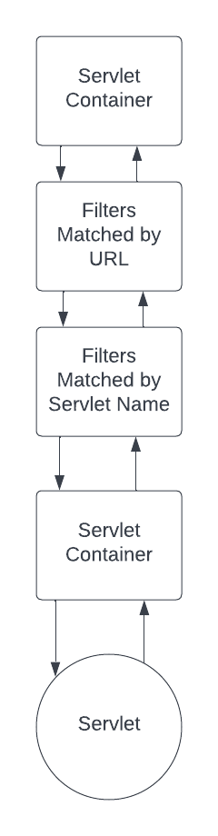

# 3. Ordering your Filters Properly

Filter Order is important when considering the logical steps that you apply to an incoming request as in for instance authenticating and authorizing an incoming request you will obviously authenticate first before you authorize when using filters.

As far as we know we can not set up Filter Orders using annotations in the Servlet 4.0 Specification which is part of the overall Jakarta JEE 8 framework release (let us know if you know how to do this). Therefore we will need to use the deployment descriptor in web.xml and programmatic configuration.

### URL Pattern Mapping versus Servlet Name Mapping

Filters are ordered in the order they appear in the configuration web.xml file or in the way they are ordered programmatically for a specific incoming request.
You can also do both and us the addMapping* methods. 

The above figure displays filter order, it shows different requests to different servlets maps to different filters but in the same high level order.

URL mappings are given precedence above servlet name mappings, which means if a filter is mapped to both the URL name filter always execute first. 

		<filter-mapping>
			<filter-name>servletFilter</filter-name>
			<servlet-name>myServlet</servlet-name>
		</filter-mapping>

		<filter-mapping>
			<filter-name>myFilter</filter-name>
			<servlet-name>/foo*</servlet-name>
		</filter-mapping>
		
		<filter-mapping>
			<filter-name>anotherFilter</filter-name>
			<servlet-name>/foo/bar</servlet-name>
		</filter-mapping>

A request comes in that matches all 3 filters above. With the URL */foo/bar* so myFilter, anotherFilter  executes in this order first and then servletFilter will execute because URL takes precedence over name.

Order of execution is 
1) myFilter
2) anotherFilter
3) servletFilter
