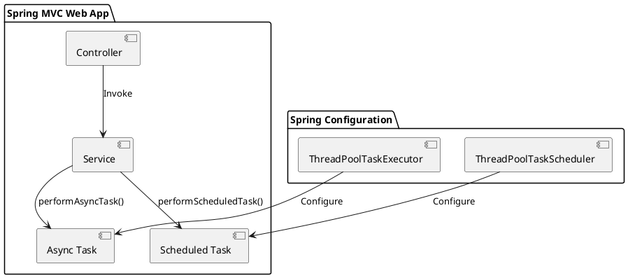

Certainly! Below is a high-level UML diagram using PlantUML notation to summarize the architecture and components involved in enhancing Spring MVC services with asynchronous and scheduled execution:

This diagram illustrates the key components involved:

- The **Controller** interacts with the **Service** layer.
- The **Service** layer contains methods annotated with `@Async` and `@Scheduled` for asynchronous and scheduled tasks.
- Spring configuration includes **ThreadPoolTaskExecutor** and **ThreadPoolTaskScheduler** beans for configuring asynchronous and scheduled task execution, respectively.

This high-level UML diagram provides a visual representation of how the components interact within the Spring MVC web application and how asynchronous and scheduled tasks are configured.